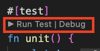

# Binary Tree Level Order Traversal

See [leetcode](https://leetcode.com/problems/binary-tree-level-order-traversal/) for problem description.

If you get stuck you can peak at the [solution](./solution.rs)

## Make a new submission

Copy [template.rs](./template.rs)

```bash
#from root
cd src/problems/binary_tree_level_order_traversal/submissions
cp template.rs {submissionUuid}.rs
```

Update [subissions/mod.rs](./submissions/mod.rs)

Have fun making your own implementation :)

## Testing a new submission

Once you're ready enable the `#[test]`

To run the test you have a few options

1. Give the unit test a unique name and run

```bash
cargo test unq_test_name
```

2. If you wish to keep the test name as `unit` and run the following w/ submission name

```bash
cargo test --package reetcode --lib -- problems::binary_tree_level_order_traversal::submissions::{submissionUuid}::test::unit
```

3. Use your IDE's run & debug feature ex: VsCode's


